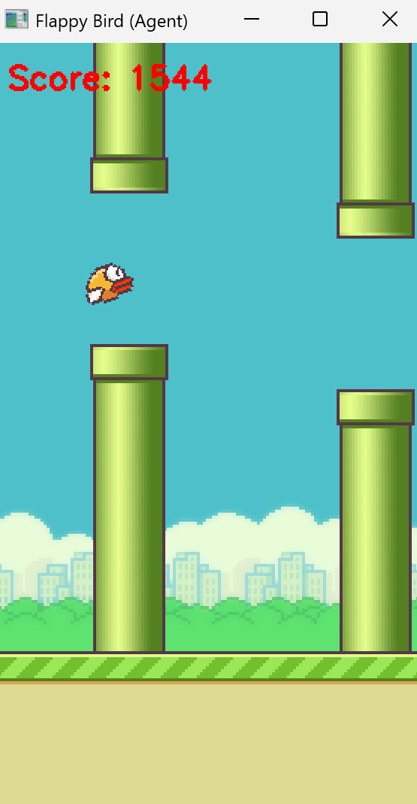
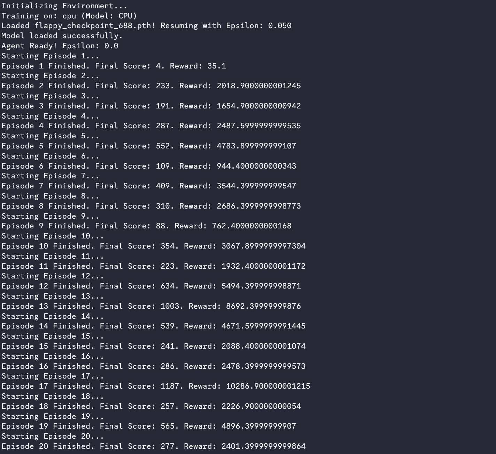
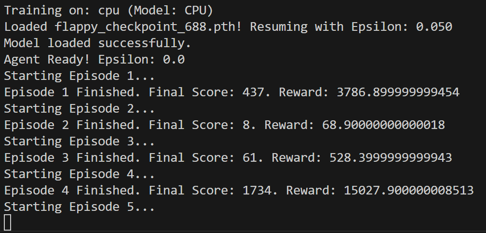
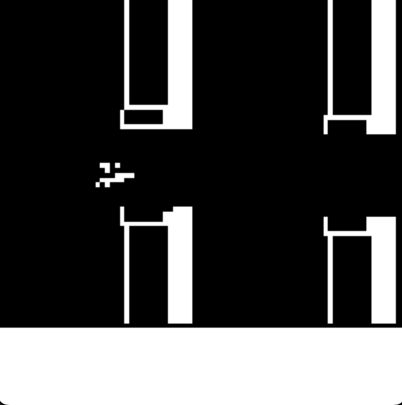

# Flappy Bird Reinforcement Learning Agent
## Dueling Double DQN with Reward Shaping

---

## 1. Introduction

This project implements a Deep Reinforcement Learning agent capable of playing **Flappy Bird** using raw pixel input.  
The agent is trained using a **Dueling Double Deep Q-Network (Dueling Double DQN)** architecture, combined with frame stacking, frame skipping, and reward shaping to stabilize learning and improve performance.

The implementation is based on:
- gymnasium
- flappy_bird_gymnasium
- PyTorch

---

## 2. Environment and Observation Processing

### 2.1 Environment

- Environment: FlappyBird-v0  
- Rendering mode: rgb_array  

### 2.2 Observation Wrapper

A custom wrapper is used to preprocess raw frames before they are passed to the neural network.

**Preprocessing steps:**
- RGB to grayscale conversion
- Resize frames to 84 × 84 pixels
- Stack 4 consecutive frames
- Apply frame skipping (2 frames per action)

**Final observation shape:**
(4, 84, 84)

Frame stacking provides temporal information such as velocity and acceleration, which are not explicitly available in the environment state.

---

## 3. Reward Engineering

### 3.1 Base Rewards

The original environment provides:
- +1 reward for passing a pipe
- Negative reward on collision (episode termination)

### 3.2 Custom Reward Shaping

To reduce sparse rewards and speed up learning, additional reward shaping was introduced.

#### Pipe Reward Boost
Passing a pipe gives:
+5.0 reward

This ensures scoring is the primary objective.

#### Vertical Alignment Reward
A smooth reward encourages the bird to stay near the center of the pipe gap:
exp(-|bird_y - gap_center| / 30)
This reward is scaled by an alignment factor that is gradually reduced during training.

#### Terminal Penalty
Collision: -5.0 reward

---

## 4. Neural Network Architecture

### 4.1 Dueling DQN

The network is split into two separate streams:
- **Value stream**: estimates the quality of the current state
- **Advantage stream**: estimates the relative advantage of each action

The final Q-value is computed as:
Q(s,a) = V(s) + A(s,a) - mean(A(s,*))

---

### 4.2 Convolutional Feature Extractor

| Layer | Configuration |
|------|--------------|
| Conv1 | 32 filters, 8×8 kernel, stride 4 |
| Conv2 | 64 filters, 4×4 kernel, stride 2 |
| Conv3 | 64 filters, 3×3 kernel, stride 1 |
| Activation | ReLU |

---

## 5. Learning Algorithm

### 5.1 Double DQN

Double DQN is used to reduce Q-value overestimation:
- The policy network selects the best next action
- The target network evaluates that action

This significantly improves training stability.

---

### 5.2 Replay Buffer

- Capacity: 300,000 transitions
- Sampling: Uniform random sampling
- Training starts after 3,000 steps

---

## 6. Hyperparameters

| Parameter | Value |
|----------|------|
| Discount factor (γ) | 0.99 |
| Batch size | 64 |
| Learning rate | 1e-4 |
| Replay buffer size | 300,000 |
| Frame stack | 4 |
| Frame skip | 2 |
| Target update frequency | 6,000 steps |
| Gradient clipping | 1.0 |
| Optimizer | Adam |

---

## 7. Exploration Strategy

An epsilon-greedy exploration strategy is used.

| Parameter | Value |
|----------|------|
| Initial ε | 1.0 |
| Minimum ε | 0.05 |
| Decay rate | 0.99997 per step |

This allows extensive exploration early in training and gradual exploitation later.

---

## 8. Training Strategy

- Training performed every 2 environment steps
- Target network updated periodically
- Model checkpoints saved every 1,000 episodes
- Training automatically resumes from saved checkpoints

---

## 9. Experimental Results

After training, the agent was evaluated by loading a previously saved checkpoint and running the policy in a purely exploitative mode (ε = 0.0), meaning no random actions were taken.

The following log shows the performance over 20 consecutive evaluation episodes:
--

---
As you can see from the following image this is our highscore:

---
We also have tried other processation like keeping only the outlines of the bird and the pipes but it didn't train better than the grayscale one

